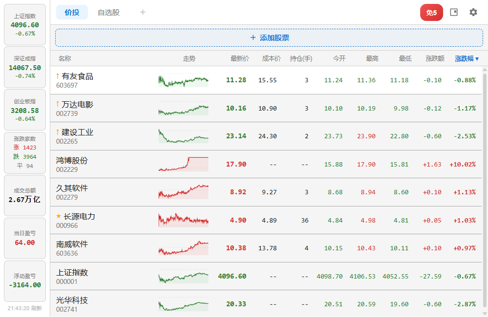
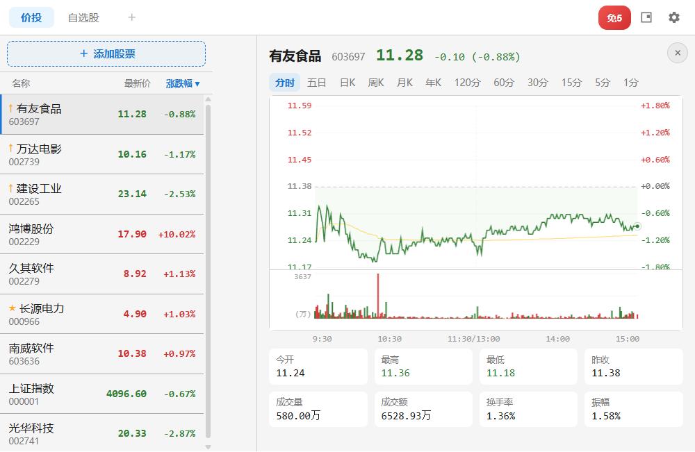
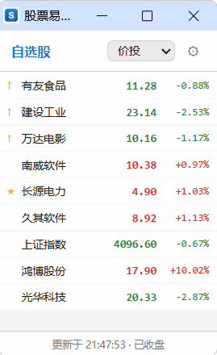

# 股票易 - A股实时行情盯盘助手

  

  <b>轻量级浏览器股票盯盘插件，股民炒股必备工具</b>

  
  
  
  

---

## 简介

**股票易**是一款免费的浏览器扩展插件，支持 Chrome / Edge 等 Chromium 内核浏览器。无需打开任何网页或APP，直接在浏览器中实时查看A股行情，边工作边盯盘。

## 核心功能

| 功能 | 说明 |
|------|------|
| **实时行情** | 沪深A股实时报价，支持自定义刷新频率（3~60秒） |
| **分时/K线图** | 分时走势、五日线、日K/周K/月K/年K，多周期一键切换 |
| **分组管理** | 自选股多分组管理，拖拽排序，置顶/置底 |
| **盈亏计算** | 输入成本价和持仓数量，自动计算当日盈亏和浮动盈亏 |
| **角标提醒** | 浏览器图标实时显示重点关注股票的涨跌幅或价格 |
| **迷你窗口** | 独立悬浮小窗口，最小化占用屏幕空间 |
| **大盘概览** | 左侧栏显示上证/深证/创业板指数、涨跌家数、成交总额 |
| **主题切换** | 深色/浅色主题，支持透明度调节 |

## 插件截图

  

  

  

> 截图仅供参考，实际界面以最新版本为准。

## 安装方式

### 方式一：应用商店安装（推荐）

- **Chrome 用户**：前往 [Chrome 应用商店](https://chromewebstore.google.com) 搜索「股票易」，点击安装
- **Edge 用户**：前往 [Edge 外接程序](https://microsoftedge.microsoft.com/addons) 搜索「股票易」，点击安装

### 方式二：本地安装（开发者模式）

1. 下载本仓库代码并解压
2. 打开浏览器，进入 `chrome://extensions`
3. 开启右上角「开发者模式」
4. 点击「加载已解压的扩展程序」，选择项目文件夹
5. 插件图标出现在浏览器工具栏即安装成功

## 使用说明

1. **添加自选股**：点击「+ 添加股票」按钮，搜索股票代码或名称
2. **查看详情**：点击股票名称，右侧滑出分时/K线详情面板
3. **分组管理**：点击分组标签旁的「+」按钮添加分组，右键股票可置顶/删除
4. **盈亏跟踪**：双击「成本价」或「持仓」列直接编辑，左侧自动显示盈亏
5. **迷你窗口**：点击工具栏的迷你窗口按钮，打开独立悬浮小窗
6. **个性设置**：点击齿轮图标，调整主题、透明度、刷新频率等

## 数据来源

行情数据来自东方财富公开API，仅供参考，不构成投资建议。

## 隐私说明

- 本插件 **不收集任何用户个人信息**
- 所有数据（自选股、持仓、设置）均存储在浏览器本地
- 仅向东方财富API请求公开行情数据
- 详细隐私政策请查看 [隐私政策](privacy-policy.html)

## 反馈与建议

如遇到问题或有功能建议，欢迎通过以下方式联系：

- **微信**：rujg8888
- **Gitee Issues**：在本仓库提交 Issue

如果觉得好用，请到应用商店给个 **五星好评** ⭐，你的支持是我持续更新的动力！

## 更新日志

### v1.0.0（2026-03-07）
- 首次发布
- 支持沪深A股实时行情查看
- 分时图、多周期K线图
- 自选股分组管理
- 成本价/持仓盈亏计算
- 迷你悬浮窗口
- 深色/浅色主题

## 开源协议

MIT License
